<div align="center">



<br/>

[](mailto:mukeshrawat68@gmail.com)
[](https://www.linkedin.com/in/mukesh-rawat/)
[](https://github.com/mtechraw)

</div>

## `$ cat about.md`

Full-stack developer gone deep on **applied AI**. I ship production voice agents, LLM vision pipelines, and the boring-but-critical plumbing around them — plus sites that fly (Core Web Vitals surgery) and tracking that survives 2026 privacy rules.

```yaml
mukesh:
  role: AI Engineer · Full-Stack Developer · Independent Consultant
  ai_work:
    - Voice AI agents (Retell, Vapi) — outbound sales & support bots in production for real clients
    - LLM vision pipelines — GPT-4o OCR that turns messy food labels into clean MongoDB documents
    - Agent design — system prompts, call flows, tool/function calling, guardrails, failure handling
    - MCP integrations — wiring LLMs into live business data (analytics, CRMs, APIs)
  also:
    - Web performance — LCP/INP/CLS audits, Nuxt/Vue optimization, GTM diet plans
    - MarTech engineering — Consent Mode v2, TCF 2.2 CMPs, Meta/social CAPI
    - Backend — PHP/Laravel, Node.js, Python, MongoDB, Redis/KeyDB
  currently: shipping client work + building in public
  fun_fact: "My agents have talked to more prospects this month than most sales teams"
```

## `$ ./run --stack=ai`

<div align="center">


</div>

```text
┌─ ai-lab ────────────────────────────────────────────────────────────┐
│ ▸ voice-agents/      outbound sales & support bots · live traffic   │
│ ▸ vision-ocr/        GPT-4o label scanner · MongoDB · Azure OAuth   │
│ ▸ agent-tooling/     function calling · guardrails · evals          │
│ ▸ llm-integrations/  MCP servers · analytics · CRM pipelines        │
│   (client work — private repos)                          [██████░░] │
└──────────────────────────────────────────────────────────────────────┘
```

## `$ ls ./featured --sort=stars`

<table>
<tr>
<td width="50%" valign="top">

### 🛡️ [consent-mode-gtm](https://github.com/mtechraw/consent-mode-gtm)
Google **Consent Mode v2** implementation for GTM — the privacy-compliance piece most sites get wrong. ⭐ 11

</td>
<td width="50%" valign="top">

### 📡 [social-capi-php](https://github.com/mtechraw/social-capi-php)
**SocialCAPI** — Laravel package for server-side Conversions API integration with social platforms. ⭐ 8 · 🍴 1

</td>
</tr>
</table>

## `$ which --skills`

<div align="center">


</div>

## `$ htop --user=mtechraw`

<div align="center">


</div>

## `$ ping mukesh`

Fastest routes in: 📧 [mukeshrawat68@gmail.com](mailto:mukeshrawat68@gmail.com) · 💼 [LinkedIn](https://www.linkedin.com/in/mukesh-rawat/)

Open to: voice AI builds · LLM/vision pipelines · performance audits · tracking & consent implementations.

<div align="center">

`exit 0` — *thanks for scrolling* 👋

</div>
